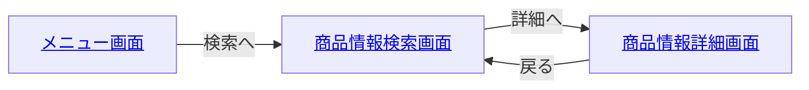

# 画面一覧
[商品検索画面](?path=/docs/docs-search-searchwithresults--docs)
[商品情報詳細画面](?path=/docs/docs-search-searchdetail--docs)

## 状態別表示
- [ローディング中](?path=/docs/docs-search-searchloading--docs)
- [検索前](?path=/docs/docs-search-searchdefault--docs)
- [バリデーションエラー](?path=/docs/docs-search-searchvalidationerror--docs)
- [削除ダイアログ表示](?path=/docs/docs-search-searchwithresults--docs)

