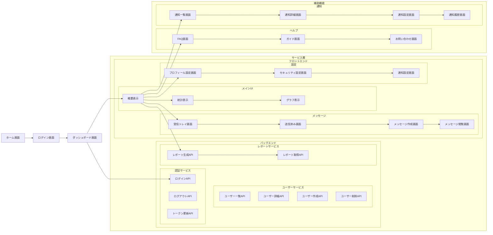

# 画面遷移図

```mermaid
%%{init:{flowchart:{useMaxWidth:true}}}%%
flowchart LR
  %% Level1: コア画面
  Home[ホーム画面]
  Login[ログイン画面]
  Dashboard[ダッシュボード画面]

  Home --> Login --> Dashboard

  %% Level2: サービスレイヤー
  subgraph サービス層
    subgraph バックエンド
      subgraph 認証サービス
        AuthLogin[ログインAPI]
        AuthLogout[ログアウトAPI]
        AuthRefresh[トークン更新API]
      end

      subgraph ユーザーサービス
        UserList[ユーザー一覧API]
        UserDetail[ユーザー詳細API]
        UserCreate[ユーザー作成API]
        UserDelete[ユーザー削除API]
      end

      subgraph レポートサービス
        ReportGen[レポート生成API]
        ReportFetch[レポート取得API]
      end
    end

    subgraph フロントエンド
      subgraph メインUI
        DashOverview[概要表示]
        DashStats[統計表示]
        DashGraph[グラフ表示]
      end

      subgraph メッセージ
        MsgInbox[受信トレイ画面]
        MsgSent[送信済み画面]
        MsgCompose[メッセージ作成画面]
        MsgRead[メッセージ閲覧画面]
      end

      subgraph 設定
        SetProfile[プロフィール設定画面]
        SetSecurity[セキュリティ設定画面]
        SetNotif[通知設定画面]
      end
    end
  end

  Dashboard --> AuthLogin
  Dashboard --> DashOverview
  DashOverview --> DashStats --> DashGraph

  DashOverview --> MsgInbox
  MsgInbox --> MsgSent --> MsgCompose --> MsgRead

  DashOverview --> SetProfile --> SetSecurity --> SetNotif

  DashOverview --> ReportGen --> ReportFetch

  %% Level3: 補助画面
  subgraph 補助機能
    subgraph ヘルプ
      HelpFAQ[FAQ画面]
      HelpGuide[ガイド画面]
      HelpContact[お問い合わせ画面]
    end

    subgraph 通知
      NotifList[通知一覧画面]
      NotifDetail[通知詳細画面]
      NotifSettings[通知設定画面]
      NotifHistory[通知履歴画面]
    end
  end

  DashOverview --> HelpFAQ --> HelpGuide --> HelpContact
  DashOverview --> NotifList --> NotifDetail --> NotifSettings --> NotifHistory
```

